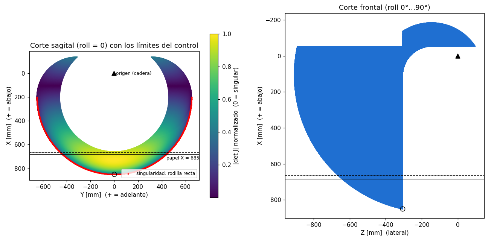
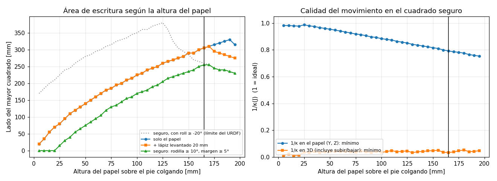
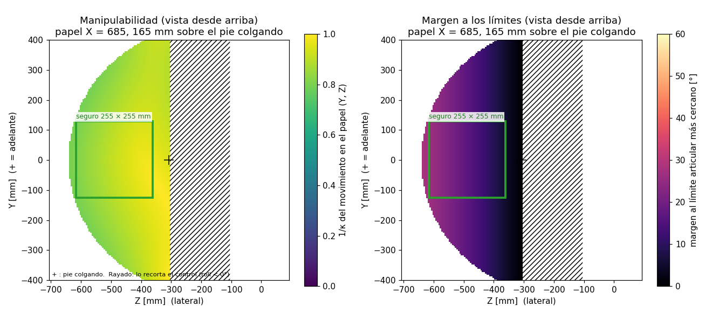

# Espacio de trabajo, singularidades y superficie de escritura de la pata

## 1. Propósito

Este documento responde a una pregunta concreta: **¿dónde conviene colocar
una superficie horizontal (una hoja sobre una mesa o el piso) para que el
efector final de la pierna dibuje o escriba una trayectoria?**

Para responderla se analizan:

1. el **modelo cinemático** del robot construido (CAD V6),
2. su **espacio de trabajo** (los puntos que el pie puede alcanzar),
3. sus **singularidades** (configuraciones donde la pierna pierde capacidad de
   movimiento),
4. los **límites articulares** que aplica el control,
5. y, con todo lo anterior, la **altura, posición y tamaño** de la mejor
   superficie de escritura.

El análisis se hace para la pierna izquierda. La derecha es simétrica
(sección 8.5).

Todos los números y figuras se generan con el script
`scripts/espacio_trabajo/analisis_espacio_trabajo.py` (sección 10), que usa
la misma cinemática que la pestaña Trayectorias de la interfaz y el trazador
(`robot_kinematics/kinem_v6.py`).

> **Versión:** convención de ángulos y límites del **URDF V9** (commit
> `1904bf2`: marco fijo en `Base_link`, la rodilla ya no se invierte en el
> control, cadera roll de 0° a 90°). Todas las coordenadas están en el
> **sistema de las pestañas de cinemática inversa del equipo** (sección 3).

------------------------------------------------------------------------

## 2. Resumen

| | Valor recomendado (pierna izquierda) |
|---|---|
| Altura del papel | **165 mm por encima de la punta del pie con la pierna colgando**, es decir el plano **X = 685.28 mm** |
| Elevación del lápiz entre trazos | **20 mm** (X = 665.28) |
| Área de escritura segura | **255 × 255 mm** |
| Centro del área | **Y = 0, Z = −489.48 mm**: alineado con el pie (adelante/atrás) y **182.5 mm hacia fuera** de la pierna |
| Pose de la pierna en el centro del papel | roll **16.8°**, pitch **32.0°**, rodilla **61.3°** (ángulos de la interfaz) |
| Calidad del movimiento en el papel | 1/κ ≥ 0.79 en toda el área |
| Distancia a la singularidad | rodilla ≥ 10° en toda el área |
| Margen a los límites articulares | ≥ 5° en toda el área, también con el lápiz levantado |

El factor que más limita el área es la **cadera roll, que no puede bajar de
0°**: el pie no puede ir hacia dentro de la pierna. Si la cadera roll
pudiera llegar a −20° (el límite del antiguo URDF V6), el área segura sería
de **380 × 380 mm** (sección 8.3).

Estos valores están en `kinem_v6.PAPEL_RECOMENDADO`, que usan la pestaña
Trayectorias (pose de preparación) y el trazador (valores por defecto).

------------------------------------------------------------------------

## 3. Sistema de coordenadas y modelo cinemático

### 3.1 Sistema de coordenadas

Es el de las pestañas de cinemática inversa del equipo
(`cinematica_directa_der_izq.py`), en mm, con origen en la base de la
cadera:

- **+X a lo largo de la pierna, hacia abajo** (vertical).
- **+Y hacia adelante.**
- **Z lateral:** la pierna izquierda está en −Z y la derecha en +Z. "Hacia
  fuera" de la pierna izquierda es −Z.
- **Un papel horizontal es un plano X = constante.** Subir es restar a X.

| Pie con la pierna colgando | Sistema del equipo | Mundo de RViz (`world`) |
|---|---|---|
| Izquierda | (850.28, 0, −306.98) | (94.9, 305.5, −858.9) |
| Derecha | (850.28, 0, 306.98) | (81.6, −304.0, −858.6) |

Los dos pies quedan a la misma altura en el mundo y separados ±305 mm, como
corresponde a un robot simétrico.

### 3.2 Modelo cinemático (CAD V6)

El robot físico está construido con el CAD V6. Por dentro,
`kinem_v6.py` calcula con un Denavit-Hartenberg con articulación fantasma,
porque los métodos de cinemática inversa del equipo (geométrico, desacople,
MTH) están escritos para esa tabla. Para la **pierna izquierda**:

```text
        theta   d     a     alpha
  0A1    0     -L1    L2    -90°
  1A2    q1     0     0      90°   <- fantasma: cadera roll
  2A3    0      L3    L4      0
  3A4    q2     0     L5    180°   <- cadera pitch
  4A5    q3     0     L6      0    <- rodilla
```

| Parámetro | L1 | L2 | L3 | L4 | L5 | L6 |
|---|---|---|---|---|---|---|
| Valor [mm] | 147.03 | 105.1 | 159.95 | 94.9 | 311.97 | 338.31 |

L5 es el muslo (cadera pitch → rodilla) y L6 la pierna (rodilla → pie). Son
las mismas longitudes que usa `cinematica_directa_der_izq.py`.

La pierna derecha es la misma cadena con `d = +L1` y los ángulos α de 0A1 y
1A2 cambiados de signo. Se cumple exactamente:

```text
T_derecha(q1, q2, q3) = Traslación(0, 0, 2·L1) · T_izquierda(−q1, q2, q3)
```

Por eso todos los métodos se escriben una vez, para la pierna izquierda.

La base de esa tabla DH no es la del equipo, pero la relación es exacta y
`kinem_v6` la aplica en todas sus entradas y salidas: **hacia fuera solo
salen coordenadas del sistema del equipo**.

### 3.3 Validación del modelo

| Comprobación | Resultado |
|---|---|
| Pie de `kinem_v6` frente a `cinematica_directa_der_izq` (ambas piernas, 600 poses en `test_kinem_v6.py`) | idéntico (< 10⁻⁶ mm) |
| Pie → mundo, frente al URDF V9 (`robot_completo.urdf.xacro`) | **~2 mm** de diferencia máxima |
| Cinemática inversa (geométrica y desacople) y verificación MTH, ida y vuelta en 600 poses | 0 fallos |
| Trayectoria de prueba (cuadrado de 200 mm del trazador) en la pestaña Trayectorias | lápiz en el plano del papel a 0.000 mm, nunca por debajo |
| Punta del pie (extremo de L6) frente a la malla 3D del pie | a ~12–20 mm de la malla, a lo largo del eje de la pierna |

### 3.4 Convenio de ángulos

La interfaz (`teleop_node`) y el control (`control_node`) usan ángulos
**t = (roll, pitch, rodilla)**, con **t = 0 = pierna colgando**,
**+pitch = pierna hacia adelante** y **+rodilla = pierna hacia atrás
(flexión)**. Es la convención del URDF V9, que el control publica sin
invertir signos.

> **Cambio respecto a la versión V6.** Antes el control invertía la
> rodilla antes de publicar. Con el URDF V9 la rodilla cambió de signo. Por
> eso las trayectorias generadas antes de este cambio llevan la rodilla al
> revés y hay que volver a generarlas.

Movimiento del pie al mover cada articulación +10° desde la pierna
colgando:

| Articulación | Pie izquierdo (X, Y, Z) [mm] | Pie derecho (X, Y, Z) [mm] |
|---|---|---|
| roll +10° | (−39, 0, −127): sube y va hacia fuera | (−39, 0, +127): sube y va hacia fuera |
| pitch +10° | (−10, +113, 0): hacia adelante | (−10, +113, 0): hacia adelante |
| rodilla +10° | (−5, −59, 0): hacia atrás | (−5, −59, 0): hacia atrás |

> **Supuesto a verificar en el robot real:** que el modelo 3D de RViz
> (URDF V9) se mueva igual que el robot físico con los mismos ángulos.
> Comprobarlo es rápido: mueve cada articulación +10° desde la interfaz y
> verifica que el robot real se mueve como el modelo de RViz y como indica
> la tabla. En especial, que con **rodilla +30°** la pierna se dobla hacia
> atrás en los dos.

------------------------------------------------------------------------

## 4. Espacio de trabajo



En las dos figuras el eje vertical es X, con **+X hacia abajo**, así que se
ven como el robot: la cadera arriba (triángulo) y el pie abajo.

**Izquierda: corte sagital (roll = 0), plano Y–X.** Muestra los puntos que
alcanza el pie moviendo cadera pitch y rodilla dentro de los límites del
control. El color indica |det J| normalizado: amarillo es lejos de una
singularidad y morado es cerca. El borde rojo es la **singularidad de
rodilla recta**. El círculo es el pie colgando. Las líneas horizontales son
el papel recomendado (continua) y el lápiz levantado (discontinua).

**Derecha: corte frontal, plano Z–X.** Todo el espacio alcanzable. Como la
cadera roll solo puede ir de 0° a 90°, el pie puede desplazarse mucho hacia
fuera (−Z) pero **nada hacia dentro**: la región termina en la vertical del
pie colgando (Z = −306.98).

Lo que importa para escribir:

- Un **papel horizontal** (X constante) corta el espacio de trabajo en una
  media región: la mitad de un círculo, cortada justo bajo el pie colgando
  por el límite de roll.
- **Al subir el papel, la región crece**: la rodilla se dobla más y el pie
  puede extenderse más hacia los lados. Esto ocurre hasta que la rodilla se
  acerca a su tope de 90°.

------------------------------------------------------------------------

## 5. Singularidades

La cadena tiene la misma estructura que una pierna roll–pitch–pitch: la
cadera roll hace pivotar un mecanismo plano de dos eslabones (L5 y L6). El
Jacobiano se anula en dos casos.

### 5.1 Rodilla recta

- **Dónde:** en el **borde exterior** del espacio de trabajo, con la pierna
  completamente estirada (el borde rojo de la figura). La pierna colgando
  (t = 0) está justo en esta singularidad.
- **Qué pasa:** el pie no puede moverse a lo largo de la pierna. Muy cerca de
  esta configuración, cambios pequeños en la posición pedida producen giros
  grandes de cadera y rodilla.
- **Consecuencia para el software:** el método del Jacobiano se atasca si
  arranca con la rodilla recta. Por eso `kinem_v6.ik_jacobiano` arranca con
  la rodilla doblada 5° cuando la semilla tiene la rodilla en 0°.
- **Consecuencia para escribir:** el área de escritura no debe llegar al
  borde de la región alcanzable. El criterio "seguro" exige **rodilla
  ≥ 10°** en todos los puntos.

### 5.2 Pie sobre el eje de roll

- **Dónde:** cuando la punta del pie queda sobre el eje de giro de la cadera
  roll.
- **Qué pasa:** girar la cadera roll no mueve el pie, así que el ángulo de
  roll queda indeterminado.
- **Consecuencia para escribir:** **ninguna.** Exige subir el pie hasta la
  altura de la cadera, muy lejos de la zona de escritura.

### 5.3 Dirección "débil" en la zona de escritura

**Dentro del papel** (Y, Z) la pierna está lejos de toda singularidad: el
número de condición inverso del Jacobiano en esas dos direcciones es
**1/κ ≥ 0.79** en toda el área recomendada, siendo 1 lo ideal. Es decir,
puede mover el lápiz casi igual de bien en cualquier dirección del papel.

La dirección peor condicionada es **casi vertical**, perpendicular al papel.
En el centro del área los valores singulares del Jacobiano son 677, 635 y
**141** mm/rad, y la dirección del menor es (−0.85, 0.12, 0.51) en
(X, Y, Z). Esto tiene dos efectos:

- **A favor:** pequeños errores de los servos cambian poco la altura del
  lápiz, así que la presión sobre el papel es estable.
- **En contra:** levantar el lápiz exige giros grandes. Para subir 20 mm en
  el centro, la rodilla pasa de 61.3° a 67.2° y el pitch de 32.0° a 35.1°.

------------------------------------------------------------------------

## 6. Límites articulares

| Articulación (convenio de la interfaz) | Control (`control_node.py`, `teleop_node.py`) | URDF V9 |
|---|---|---|
| Hip Roll | **0°** … 90° | 0° … 90° |
| Hip Pitch | −90° … 90° | −90° … 90° |
| Knee | −90° … 90° | −90° … 90° |

`control_node` **recorta en silencio** cualquier ángulo fuera de su rango.
Por eso `kinem_v6` calcula todas las soluciones de la cinemática inversa
(las dos raíces de la cadera roll y los dos codos) y elige una que respete
estos límites, con la rodilla en flexión (t3 ≥ 0). Si ninguna los respeta,
informa el punto como no alcanzable en lugar de mandarlo al control.

- **Cadera roll en 0°:** es el límite que más recorta el área de escritura
  (sección 8.3). Con 5° de margen de seguridad, la pierna trabaja con roll
  ≥ 5°, así que el área queda desplazada hacia fuera.
- **Rodilla:** el control permite −90°…90°, pero la flexión real es
  positiva (+rodilla = la pierna va hacia atrás). Se repitió el análisis
  permitiendo solo rodilla ≥ 0° y el resultado es idéntico (255 mm a
  165 mm, 205 mm a 125 mm).

Los límites viven en `control_node.py` (radianes) y `teleop_node.py`
(grados). Si cambian, hay que actualizar también
`kinem_v6.LIMITES_CONTROL_DEG` y volver a ejecutar el análisis.

------------------------------------------------------------------------

## 7. Criterios para elegir la superficie

Para cada altura del papel se calcula el **mayor cuadrado** de escritura
(alineado con Y y Z, en cualquier posición) que cumple:

1. **Alcanzable:** alguna solución de la cinemática inversa respeta los
   límites del control.
2. **Lápiz levantado:** el mismo cuadrado también es alcanzable 20 mm más
   arriba, porque entre trazos el lápiz se levanta.
3. **Seguro:**
   - lejos de la singularidad (**rodilla ≥ 10°**);
   - con **5° de margen** a cualquier límite articular, para absorber errores
     de calibración y el seguimiento imperfecto de los servos.

Además, se mide la calidad del movimiento (1/κ).

------------------------------------------------------------------------

## 8. Resultados



**Izquierda.** Lado del mayor cuadrado según la altura del papel sobre el
pie colgando. La curva verde es el criterio completo (seguro). La gris
punteada es el mismo criterio si la cadera roll pudiera llegar a −20°.

**Derecha.** Calidad del movimiento. Dentro del papel es alta (0.75–0.98) a
cualquier altura. La calidad en 3D es baja en todas las alturas, por la
dirección vertical débil (sección 5.3).

### 8.1 Tabla (pierna izquierda, límites del control, lápiz 20 mm)

| Sobre el pie colgando | X del papel | Área alcanzable | Mayor cuadrado | + lápiz levantado | **Seguro** | Centro (Y, Z) | 1/κ mín. en el papel | Roll usado |
|---|---|---|---|---|---|---|---|---|
| 25 mm | 825.3 | 231 cm² | 80 mm | 80 mm | 15 mm | (2, −379) | 0.99 | 5.1° … 6.3° |
| 60 mm | 790.3 | 690 cm² | 160 mm | 160 mm | 95 mm | (2, −419) | 0.94 | 5.4° … 12.8° |
| 100 mm | 750.3 | 1248 cm² | 225 mm | 225 mm | 170 mm | (0, −452) | 0.88 | 5.3° … 18.9° |
| 125 mm | 725.3 | 1597 cm² | 260 mm | 260 mm | 205 mm | (2, −464) | 0.85 | 5.0° … 21.8° |
| 140 mm | 710.3 | 1805 cm² | 275 mm | 275 mm | 225 mm | (2, −474) | 0.83 | 5.1° … 23.7° |
| 150 mm | 700.3 | 1943 cm² | 290 mm | 290 mm | 235 mm | (2, −479) | 0.82 | 5.2° … 24.7° |
| 160 mm | 690.3 | 2076 cm² | 300 mm | 300 mm | 250 mm | (0, −487) | 0.80 | 5.3° … 26.1° |
| **165 mm** | **685.3** | **2142 cm²** | **305 mm** | **305 mm** | **255 mm** | **(0, −489)** | **0.79** | **5.3° … 26.6°** |
| 170 mm | 680.3 | 2209 cm² | 310 mm | 310 mm | 255 mm | (2, −494) | 0.79 | 5.9° … 27.2° |
| 180 mm | 670.3 | 2342 cm² | 320 mm | 290 mm | 240 mm | (0, −512) | 0.78 | 8.4° … 28.2° |
| 190 mm | 660.3 | 2470 cm² | 330 mm | 280 mm | 235 mm | (2, −529) | 0.76 | 10.4° … 29.6° |

Las columnas "1/κ mín." y "Roll usado" se evalúan sobre el cuadrado seguro.
El pie colgando está en (Y, Z) = (0, −307). Por debajo de 25 mm no cabe
ningún cuadrado seguro: la pierna está casi estirada.

El script da el centro en Y = 2.5 mm por la resolución de la rejilla
(5 mm). Se comprobó que el cuadrado centrado en **Y = 0** también es seguro
entero, con algo más de distancia a la singularidad (rodilla ≥ 11.4°), y
es el que se usa.

El mejor papel está a **165 mm sobre el pie colgando**, y responde a un
compromiso:

- **Si el papel baja:** la pierna se acerca a estar estirada. La región
  alcanzable se achica y sus bordes se acercan a la singularidad de rodilla
  recta.
- **Si el papel sube:** la región crece, pero al levantar el lápiz la rodilla
  se acerca a su tope de 90°. A partir de ~170 mm ese límite empieza a
  recortar el área segura (columna "+ lápiz levantado").
- **Hacia dentro (+Z en la pierna izquierda):** el límite de roll (0°, con
  5° de margen) corta el área a todas las alturas, y por eso el centro
  queda 182.5 mm hacia fuera.

Entre 160 y 170 mm el área segura se mantiene en 250–255 mm, así que no hace
falta acertar la altura al milímetro.

### 8.2 Efecto de la elevación del lápiz

Cuadrado seguro [mm] y su centro (Y, Z):

| Sobre el pie | lápiz 10 mm | lápiz 20 mm | lápiz 30 mm | lápiz 40 mm |
|---|---|---|---|---|
| 140 mm | 225 (2, −474) | 225 (2, −474) | 225 (2, −474) | 225 (2, −474) |
| 150 mm | 235 (2, −479) | 235 (2, −479) | 235 (2, −479) | 230 (0, −482) |
| 160 mm | 250 (0, −487) | 250 (0, −487) | 245 (2, −489) | 220 (0, −502) |
| 165 mm | 255 (2, −489) | **255 (2, −489)** | 235 (2, −499) | 220 (0, −512) |
| 170 mm | **260** (0, −492) | 255 (2, −494) | 230 (0, −507) | 215 (2, −519) |
| 180 mm | 265 (2, −499) | 240 (0, −512) | 225 (2, −524) | 210 (0, −537) |

Con un levantamiento de 30–40 mm conviene bajar el papel a ~150 mm. Con
solo 10 mm se gana poco (265 mm a 180 mm) y se exige una superficie muy
plana.

### 8.3 El cuello de botella: la cadera roll en 0°



El mapa del papel recomendado, visto desde arriba (Z horizontal, Y
vertical, adelante arriba), muestra en rayado la zona que el robot
alcanzaría si la cadera roll pudiera llegar a −20° pero que el **control
recorta** (roll < 0°). El cuadrado verde es el área segura y la cruz es el
pie colgando: todo lo que queda a su derecha (hacia dentro de la pierna
izquierda) está fuera de alcance.

| Límite inferior de roll | Mejor papel | Cuadrado seguro | Centro (Y, Z) |
|---|---|---|---|
| 0° (actual, control y URDF V9) | 165 mm (X = 685.28) | 255 × 255 mm | (0, −489.48): 182.5 mm hacia fuera |
| −20° (antiguo URDF V6) | 125 mm (X = 725.28) | **380 × 380 mm** | (0, −342.0): 35 mm hacia fuera |

Si el mecanismo permitiera llevar la cadera roll a −20°, el área crecería
más del doble (+120 %) y quedaría casi centrada bajo el pie.

Mapa de otra altura, como referencia:

- `img/espacio_trabajo_v6/plano_125mm.png`: papel más bajo, región más
  pequeña.

### 8.4 Cómo montar la superficie

1. **Altura.** Con la pierna colgando (todo a 0° en la interfaz), mide dónde
   queda la punta del pie. La superficie del papel debe quedar **165 mm más
   arriba**. Si se usa un lápiz o marcador sujeto al pie, lo que cuenta es la
   **punta del lápiz**: el modelo toma como efector el extremo de L6.
2. **Nivel.** La superficie debe ser horizontal. Una inclinación de 1° en
   255 mm equivale a 4.5 mm de diferencia de altura entre los bordes.
3. **Posición.** La forma más directa es usar la pierna como referencia:
   - en la pestaña **Trayectorias**, botón **"Pose de preparación"**: la
     pierna queda en **(665.28, 0, −489.48)**, 20 mm
     sobre el centro del papel (roll 17.3°, pitch 35.1°, rodilla 67.2°);
   - con **(685.28, 0, −489.48)** en una pestaña de cinemática inversa, o
     **roll 16.8°, pitch 32.0°, rodilla 61.3°** en la de cinemática
     directa, la punta del pie debe quedar **tocando el papel en el
     centro** del área.
4. **Tamaño útil.** Hasta 255 × 255 mm alrededor de ese centro: 127 mm hacia
   cada lado en Y y en Z. Deja unos milímetros de margen.

> La pierna colgando queda **por debajo** del papel. Lleva la pierna a la
> pose de preparación **antes** de colocar la mesa.

En RViz, el centro del papel de la pierna izquierda está en
(94.9, 488.0, −693.9) mm del mundo.

### 8.5 Pierna derecha

Por la simetría de la sección 3, la pierna derecha tiene **la misma área**
(255 × 255 mm, mismos ángulos en el centro). Se comprobó ejecutando el
análisis con `--pierna right`: da exactamente la misma tabla, con Z
cambiado de signo. El papel está en el mismo plano **X = 685.28**, con
centro **(Y, Z) = (0, 489.48)**; en el mundo, en (81.6, −486.5, −693.6) mm,
a la misma altura que el de la izquierda.

------------------------------------------------------------------------

## 9. Uso con el software

| Componente | Qué hace |
|---|---|
| `robot_kinematics/kinem_v6.py` | Cinemática para las trayectorias, con entradas y salidas en el sistema del equipo: posición del pie, cinemática inversa (geométrica, desacople, Jacobiano) que respeta los límites del control, verificación MTH, paso al mundo de RViz y `PAPEL_RECOMENDADO`. Sirve para ambas piernas. |
| Pestaña **Trayectorias** (`robot_teleop/trayectorias_ui.py`) | Usa `kinem_v6` para la cinemática inversa, la pose de preparación y la comprobación de que el lápiz no baja del papel. El rastro de RViz se dibuja con la cinemática directa del equipo, en `Base_link`. |
| Trazador (`scripts/trazador/trazador.py`) | Papel horizontal en el plano X = constante, con los valores de este documento para cada pierna (botón "Valores recomendados", área de 255 × 255 mm por defecto) y comprobación de alcance con `kinem_v6`. |
| Pestañas de cinemática inversa del equipo y sus nodos (`ik_node`, `ik_jacob_node`, `ik_des_node`, `ik_geom_node`) | Mismo sistema de coordenadas: los puntos de este documento se pueden escribir directamente en ellas. Hoy solo `bringup_izq` lanza los nodos. |
| `scripts/analisis/analisis_espacio_trabajo.py` | Versión del equipo de este análisis. Da las mismas alturas y tamaños, pero sus ángulos y coordenadas están en la convención anterior (V6). |

Para dibujar, ver `docs/GENERACION_TRAYECTORIAS.md` (secciones 7, 8 y 10).
Las trayectorias exportadas antes del cambio a URDF V9 (papel a 140 mm,
coordenadas con Z hacia arriba, rodilla con el signo antiguo) **no
sirven**: hay que volver a exportarlas desde el trazador.

------------------------------------------------------------------------

## 10. Reproducir el análisis

```bash
cd ~/Documentos/Robot_Bipedo
python3 scripts/espacio_trabajo/analisis_espacio_trabajo.py                 # pierna izquierda
python3 scripts/espacio_trabajo/analisis_espacio_trabajo.py --pierna right  # pierna derecha
```

Requiere Python 3 con `numpy` y `matplotlib`, y tarda alrededor de un
minuto y medio. El script:

- usa `kinem_v6.py` (longitudes, convenio de ángulos, límites del control y
  cinemática inversa), y comprueba que su versión vectorizada coincide con
  el módulo;
- calcula por dentro en la base del modelo DH e imprime y dibuja todo en el
  sistema del equipo;
- imprime las tablas de este documento y guarda las figuras en
  `docs/img/espacio_trabajo_v6/` (otra carpeta con `--salida DIR`). Solo
  sobrescribe las figuras que genera; no toca las del equipo en
  `docs/img/espacio_trabajo/`.

Si cambian los límites del control, hay que actualizarlos en
`kinem_v6.LIMITES_CONTROL_DEG` (además de en `control_node.py` y
`teleop_node.py`), volver a ejecutar el script y actualizar
`kinem_v6.PAPEL_RECOMENDADO` y `PAPEL_RECOMENDADO` del trazador.

Parámetros ajustables al inicio del script:

| Constante | Valor | Significado |
|---|---|---|
| `LIFT` | 20 mm | elevación del lápiz |
| `Q3_SAFE` | 10° | distancia mínima a la singularidad de rodilla recta |
| `MARGIN_SAFE` | 5° | margen mínimo a los límites articulares |
| `STEP` | 5 mm | resolución de la rejilla (los resultados tienen esa precisión) |

------------------------------------------------------------------------

## 11. Limitaciones

- **Convenio de ángulos.** Sigue al URDF V9 del equipo (sección 3.4). Hay
  que verificarlo en el robot real antes de fiarse de los ángulos de la
  sección 8.4. Además, el offset del servo de la cadera roll en
  `teleop_node.py` cambió de 180° a 0° con el URDF V9; conviene confirmar
  con el equipo que corresponde a una recalibración del servo.
- **Modelo ideal.** No se consideran holguras ni flexión de las piezas, ni el
  error de seguimiento de los servos. El margen de 5° está pensado para
  absorber parte de eso.
- **Paso al mundo de RViz.** Coincide con el URDF V9 a ~2 mm. Afecta solo a
  dónde se dibujan los puntos en RViz, no a los ángulos.
- **Punta del pie.** El efector es el extremo de L6, a ~12–20 mm de la malla
  del pie en el CAD. Con un lápiz montado, la punta real cambia.
- **Solo áreas cuadradas.** Para dibujos alargados, el área útil puede
  aprovecharse mejor con un rectángulo. Los mapas muestran la región
  alcanzable completa.
